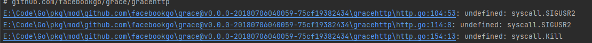

# gin-api

## 项目说明
个人爱好

## 相关文档

[命名规范](https://studygolang.com/articles/25466)

## 环境安装
```
golang 源码包下载
cd /usr/local/src;
wget https://go.dev/dl/go1.18.linux-amd64.tar.gz
tar -xzvf https://go.dev/dl/go1.18.linux-amd64.tar.gz -C /usr/local

go 环境配置

export GOROOT=/usr/local/go
export GO111MODULE="on"
export GOPATH="/data/gopath"
export GOBIN=$GOPATH/bin
export PATH=$PATH:$GOROOT/bin:$GOPATH

查看golang部署环境
go env

```

## 目录结构
> app 应用文件
>
> config 配置文件
>
> cmd 入口文件
>
> bin 入口文件编译后的可执行文件
>
> doc 基于swagger生成的文档目录 
>
> 
> 

## 项目启动
```
安装依赖包
cd cmd
go install main.go 或者 go install

开发环境启动
go run cmd/main.go start dev

项目打包及重命名
go build -v -x -o gin-api-pro bin

```

## 项目须知



windows环境下会出现提示，在linux环境下正常 
```
E:\Code\Go\pkg\mod\github.com\facebookgo\grace@v0.0.0-20180706040059-75cf19382434\gracehttp\http.go:104:53: undefined: syscall.SIGUSR2
E:\Code\Go\pkg\mod\github.com\facebookgo\grace@v0.0.0-20180706040059-75cf19382434\gracehttp\http.go:114:8: undefined: syscall.SIGUSR2
E:\Code\Go\pkg\mod\github.com\facebookgo\grace@v0.0.0-20180706040059-75cf19382434\gracehttp\http.go:154:13: undefined: syscall.Kill

```

### 依赖包下载失败
golang在github上建立了一个镜像库，如https://github.com/golang/net就对应是 https://golang.org/x/net的镜像库。 要下载golang.org/x/net包，可以在本地创建包的目录后使用git clone来拉取相应包的源代码文件，具体操作如下

```shell

mkdir -p $GOPATH/src/golang.org/x
cd $GOPATH/src/golang.org/x
git clone https://github.com/golang/net.git

安装gopm

go get -u github.com/gpmgo/gopm

使用gopm安装第三方包

不加-g参数，会把依赖包下载.vendor目录下面； 加上-g参数，可以把依赖包下载到GOPATH目录中。

gopm get -g golang.org/x/net

```

